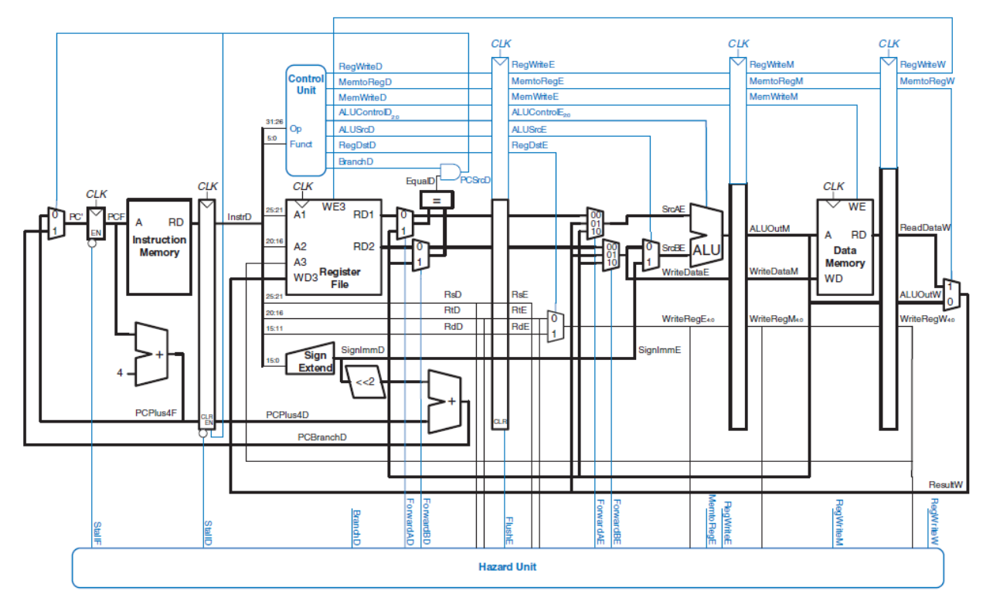

# MIPS-pipeline-implementation-in-C
> MIPS - CPU Emulator      

> code created on spring 2021    

This repository contains final code for MIPS pipeline in C language with aim to learn about the deeper about the MIPS, processor, and memory in CPU.

## Environtment
```
(2020)
code-editor: Visual Studio (C)
input: binary files
output: terminal

(2022) //to be updated
code-editor: Visual Studio (C)
input: binary files
output: terminal

```

## How to run
//to be updated

## Description Detail
The program takes binary file, containing instruction in MIPS format, as input and produce output in terminal

A few hazard handlings is included to enhance the pipeline performance, such as by forwarding, stalling, and/or early branch resolution.

Some provided input files:
- fib.bin
- gcd.bin
- simple.bin
- simple2.bin
- simple3.bin
- simple4.bin


## Documentation and resources

1. [Report](https://docs.google.com/document/d/1UfKPNGtBblIq7WNFxUQymU0hrLvIZOQQSPnGdPN_nQg/edit)
2. [MIPS Green Sheet](MIPS_Green_Sheet.pdf)
3. MIPS pipeline structure


